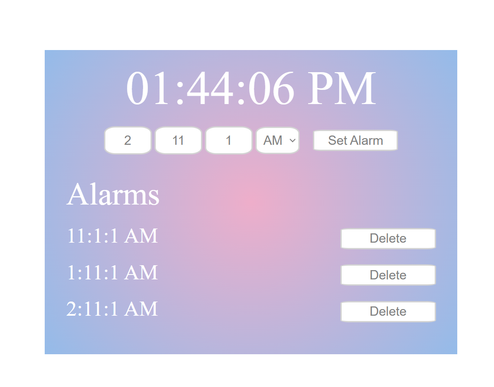

# Digital Alarm Clock

This is a simple Digital Alarm Clock web application that allows users to set and manage multiple alarms. The application is built using HTML, CSS, and JavaScript.

## Features

1. Local time is shown at the top.
2. Set alarms by specifying the hours, minutes, seconds, and time zone (AM/PM).
3. Display the list of set alarms with corresponding "Delete" buttons for each alarm.
4. Receive an alert when the set alarm time matches the current time.

## How to Use

1. Clone the repository or download the source code to your local machine.
2. Open the `index.html` file in your web browser to access the Digital Alarm Clock application.

The Digital Alarm Clock interface consists of the following components:

### Time Display

The header section will display the current time in 12-hour format with seconds (HH:MM:SS AM/PM). The time is automatically updated every second.

### Alarm Inputs

Enter the desired alarm time in the spaces provided. Choose the time zone (AM or PM) from the drop-down box and enter the alarm's hour (0-12), minute (0-59), and seconds (0-59) (all mandatory). To add the alarm to the list, click the "Set Alarm" button.

### Alarm List

The list displays all the set alarms. Each alarm item shows the time in 12-hour format, and there is a "Delete" button next to each alarm. Click the "Delete" button to remove the alarm from the list.

If an alarm time matches the current time, you will receive an alert indicating that you have set an alarm with the matching time.

## Author

This Digital Alarm Clock application is developed by Surbhi Pahwa. You can contact me at surbhipahwa36@gmail.com for any questions or inquiries related to this project.
